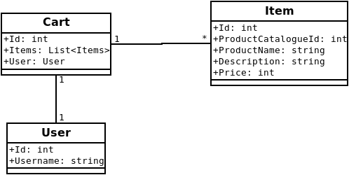

# gammerlgaard-shopping-cart
ShoppingCart services for the Shopping Cart microservices, based on [Gammerlgaard's book][1].
Master repo is [here](https://github.com/HarimbolaSantatra/gammerlgaard-shopping-cart).

### Files
- *sql/*: helper sql script
- *Test/*: python api test script for client
- *reset-migration.sh*: delete all migrations and all rows in the database

### Database
- Tech: MariaDb/MySQL
- **Name**: *shopping_cart*

### Endpoints
- GET - `/<USER_ID>`: get a user's cart information
- GET - `/items`: add multiple items to a user's cart
- POST - `/items`: get all items
- GET - `/carts`: Get all carts
- POST - `/cart`: Add a cart for a user

## ABOUT THE PROJECT
UML diagram:

*User* and *Items* datas should be populate by other microservices (WIP).

## Resources:
- [ Gammerlgaard's book ][1]
- [Containerize a .NET app](https://learn.microsoft.com/en-us/dotnet/core/docker/build-container?tabs=linux&pivots=dotnet-8-0)
- Diagram made with [Dia](https://packages.ubuntu.com/jammy/dia)

[1]: https://www.google.com/url?sa=t&rct=j&q=&esrc=s&source=web&cd=&cad=rja&uact=8&ved=2ahUKEwiAvovAk_6EAxVJXUEAHezbAmwQFnoECCwQAQ&url=https%3A%2F%2Fbooks.google.com%2Fbooks%3Fid%3DiIsKzgEACAAJ%26printsec%3Dfrontcover%26source%3Dgbs_atb&usg=AOvVaw3L2E4b--daQTJPSenAp4Q9&opi=89978449
